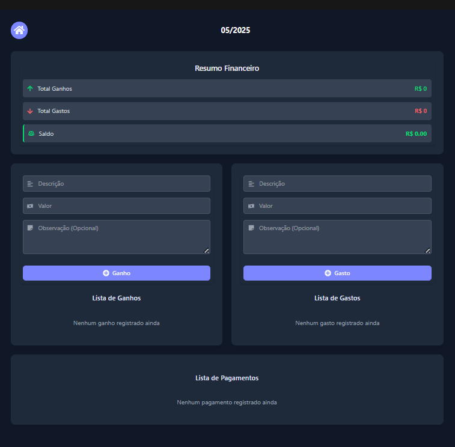

# Controle Financeiro Pessoal

Aplicação para gerenciamento de gastos e ganhos mensais com visualização por abas organizadas por mês/ano.

## 📁 Estrutura do Projeto

```
controle-financeiro/
├── backend/       # API Node.js com Express e MySQL
├── frontend/      # Aplicação React com TypeScript
└── README.md
```

## 🛠️ Tecnologias Utilizadas

### Backend
- Node.js
- Express
- MySQL
- REST API

### Frontend
- React
- TypeScript
- Tailwind CSS
- React Router
- Axios

## ⚙️ Funcionalidades Implementadas

✅ Cadastro de abas por mês/ano  
✅ Registro de ganhos e gastos  
✅ Cálculo automático de totais e saldo  
✅ Visualização em tabelas organizadas  
✅ Exclusão de itens  

## 🚧 Funcionalidades Pendentes

⏳ Edição dos ganhos (em desenvolvimento)  
⏳ Status de pagamento (boolean) para gastos  
⏳ Configuração da listagem de ganhos

## 🖼️ Screenshots


## ▶️ Como Executar

1. Backend: `npm install && node app.js`
2. Frontend: `npm install && npm run dev`

Certifique-se de configurar o banco de dados MySQL antes de iniciar.